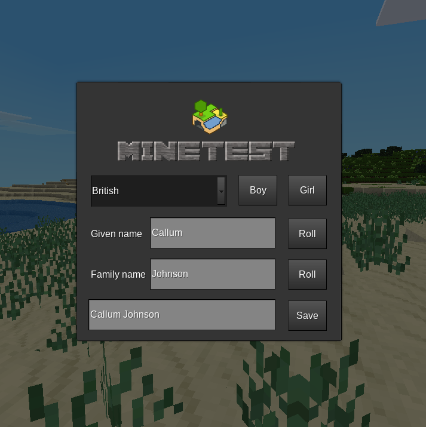

===============
real_names_redo
===============

This is a mod for `Minetest <https://www.minetest.net/>`__, a fork of the  original `real_names mod <https://github.com/Extex101/real_names/>`__ by Extex101.

It provides the ability to create "realistic" names for players, from a variety of different cultures. New lists of names (and new cultures) can be added simply by creating a few text files.

Dependencies
------------

None.

Downloads
---------

Latest release: `ZIP <https://github.com/axcore/real_names_redo/archive/master.zip>`__, or `browse the code <https://github.com/axcore/real_names_redo>`__.

Licences
--------

All code is licensed under the MIT License.

Authors/Contributors
--------------------

`A S Lewis <https://github.com/axcore/>`__, `Extex101 <https://github.com/Extex101>`__ and `rubenwardy <https://github.com/rubenwardy>`__.

FAQ
---

*Q: Why doesn't this mod provide names for $RANDOM_COUNTRY?*

A: Do it yourself, using the instructions below.

*Q: How do I change the culture visible by default?*

A: The default culture is the first one in the config file (described below), so just change the order of the lines in that file.

*Q: I typed my own names in the boxes, but they weren't used!*

A: The boxes should be greyed out, but Minetest doesn't appear to offer that functionality.

How to use
----------

Use the drop-down box to select a culture.

Click the **Boy** and **Girl** buttons to switch between male/female names. Click the **Roll** button to select a new given name, or a new family name. A random name is selected from a list.

The box at the bottom shows a full name. For some cultures, the family name might appear before the given name. When you're happy with the full name, click the **Save** button to accept it.

Two chat commands are available:

        **/name_info** - Displays your current "real" name

        **/name_info <player>** - Displays the "real" name of <player>

        **/change_name** - Opens the name selection dialogue

        **/change_name <player>** - Shows the name selection dialogue to <player>

        **/change_name <player> <first> <second>** - Sets the "real" name of <player> directly

Note that **<first>** may be the given name, or the family name, depending on the culture.

Note also that the **/change_name** command requires the **change_name** privilege.

How to modify
-------------

The mod comes with four sets of names: the original American set, a new British set, and sample sets for Czech and Vietnamese (showcasing the mod's ability to generate names in the correct format for those cultures).

Adding new cultures/names is simple. First, open the config file **../names/config.txt**  in your favourite text editor.

Every line in this file represents a single culture/language. Every line is in the format:

        **type name**

...where **name** is a name for the culture (e.g. *French*, *Japanese*), and *type* is one of the following words:

        **western slavic asian**

For the type **western**, we expect a west-European style name like *Adam Smith* or *Alice Smith*.

For the type **slavic**, we expect a Slavic-style name, in which the family name is different for boys and girls, e.g. *Tomas Novák* and *Jana Nováková*.

For the type **asian**, we expect an Asian-style name, in which the family name comes first, e.g. *Nguyễn Chi* and *Nguyễn Chau*.

Having added a new culture like *French* to the file, you should now create a sub-folder with the same name, for example **../names/French**.

This sub-folder should contain one or more of the following text files:

        **firstboy.txt**
        **firstgirl.txt**
        **last.txt**
        **lastgirl.txt**

Each text file should contain a list of names, one per line.

The first three files should exist for all cultures. For the **slavic** culture type, use **last.txt** to specify male family names, and **lastgirl.txt** to specify female family names.
